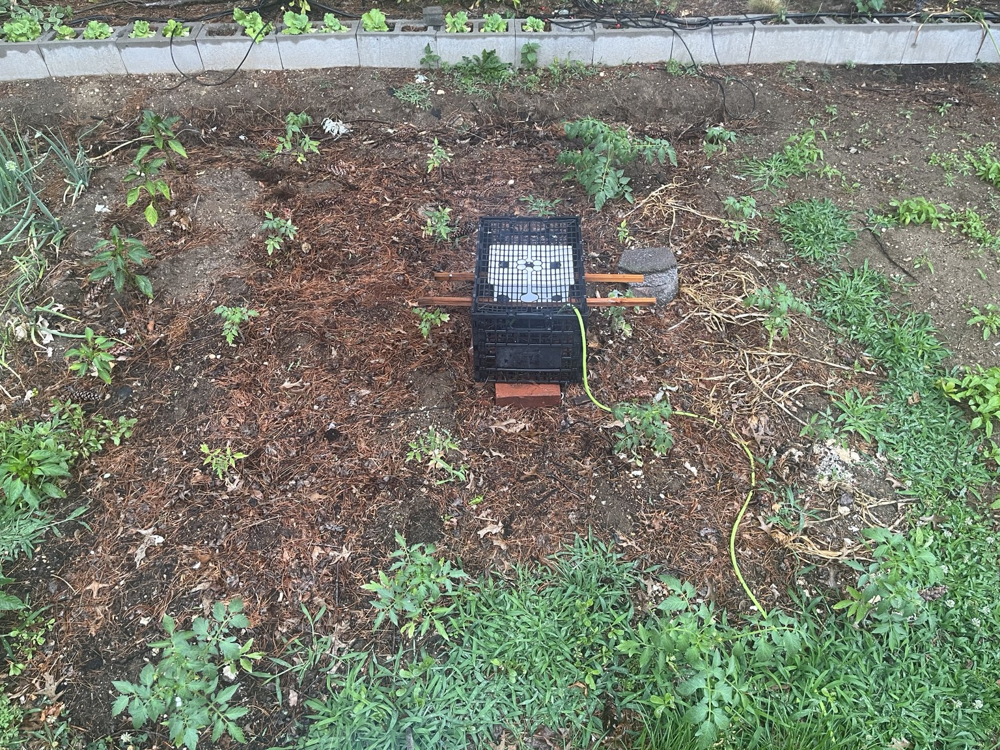
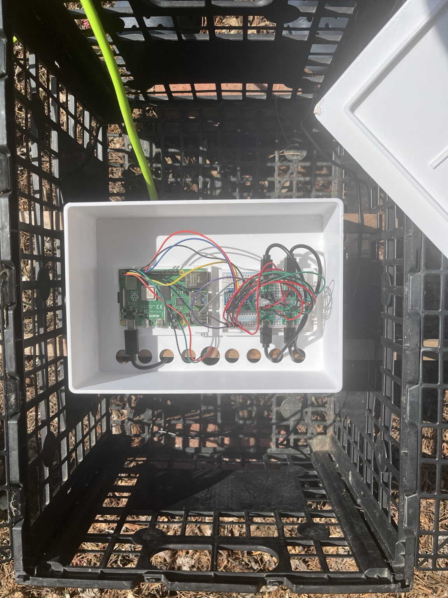
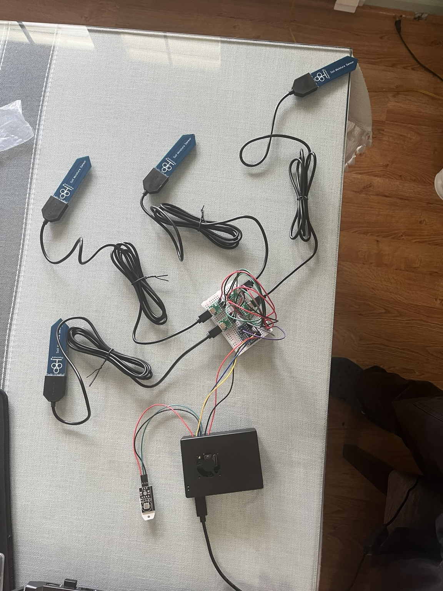
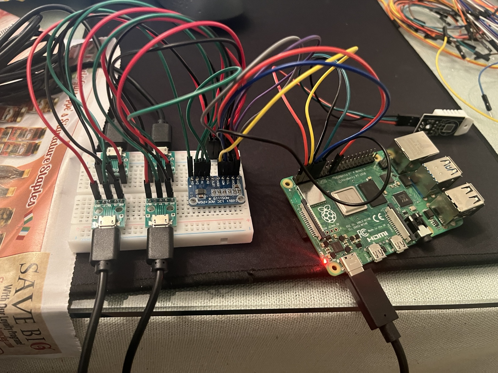
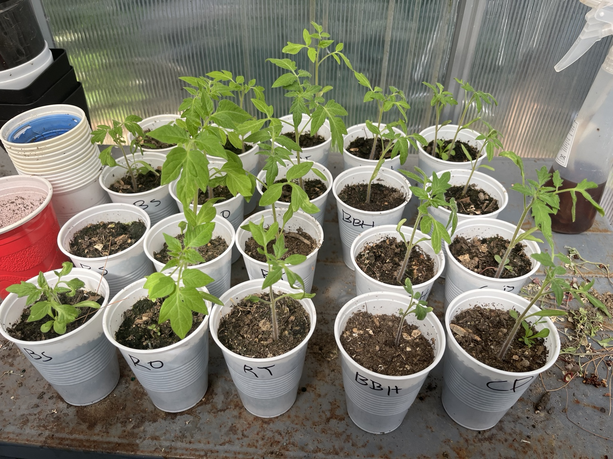
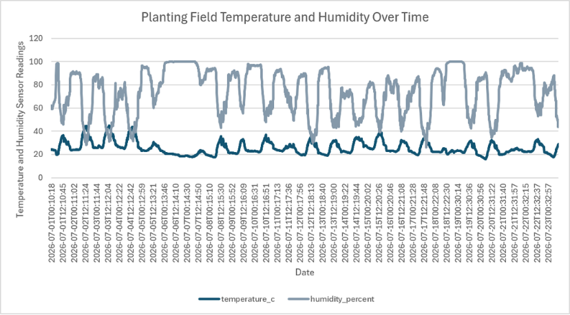
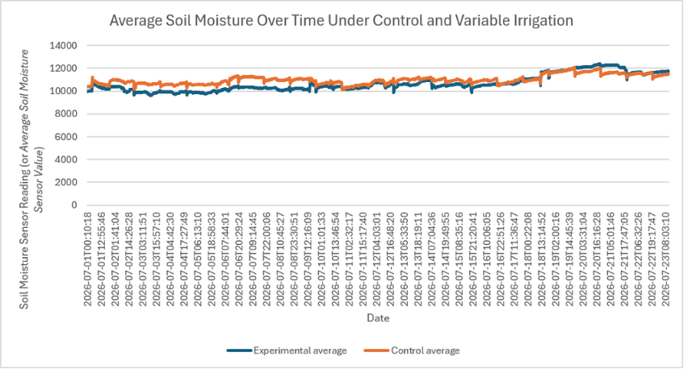
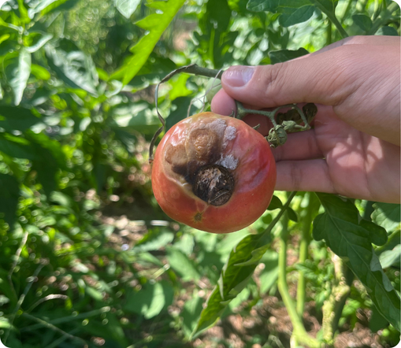

# Raspberry Pi Tomato Irrigation Monitoring System

An automated environmental monitoring system developed for a tomato irrigation research project at the **Boyce Thompson Institute (BTI)**.

I built and programmed a Raspberry Pi-based system to continuously measure **temperature, humidity, and soil moisture across two irrigation treatments**. The system integrated four analog soil moisture sensors through an ADS1115 ADC and automatically logged measurements every 15 minutes for later analysis of soil moisture variability and blossom-end rot (BER).

## System Overview

The monitoring system was designed to collect environmental data continuously during an outdoor tomato experiment without requiring manual measurements.

The Raspberry Pi collected data from two sensor systems:

- A **DHT22** measured ambient temperature and relative humidity.
- Four **capacitive soil moisture sensors** measured soil conditions across the experimental and control irrigation treatments.
- An **ADS1115 analog-to-digital converter** allowed the Raspberry Pi to read all four analog soil moisture sensors.

A Python program collected readings from all sensors, timestamped each measurement, and stored the data in a CSV file.

The logger was configured as a Linux `systemd` service so monitoring could run automatically on the Raspberry Pi.

## Hardware

- Raspberry Pi 4
- DHT22 temperature and humidity sensor
- ADS1115 16-bit analog-to-digital converter
- 4 capacitive soil moisture sensors
- Breadboard
- Jumper wires
- Outdoor enclosure

## System Architecture

```text
                         ┌── DHT22
                         │   Temperature
                         │   Humidity
                         │
Raspberry Pi 4 ──────────┤
                         │
                         └── ADS1115 ADC
                                │
                                ├── Soil Sensor 1 ── Experimental
                                ├── Soil Sensor 2 ── Experimental
                                ├── Soil Sensor 3 ── Control
                                └── Soil Sensor 4 ── Control
```

The DHT22 communicated directly with the Raspberry Pi, while the ADS1115 converted the analog outputs from the four soil moisture sensors into digital readings accessible through Python.

## Software

The monitoring software was written in **Python** using Adafruit CircuitPython libraries.

The deployed logger is located at:

`src/sensor_logger.py`

Each sampling cycle records:

- Timestamp
- Temperature (°C)
- Relative humidity (%)
- Raw value from each of four soil moisture sensors
- Voltage from each of four soil moisture sensors

The sampling interval was set to:

```python
SAMPLE_INTERVAL_SECONDS = 900
```

which corresponds to one measurement every **15 minutes**.

Sensor-reading errors from the DHT22 were handled without terminating the logger, allowing data collection to continue after temporary read failures.

## Automated Operation

The monitoring program was configured as a `systemd` service:

`systemd/sensor_logger.service`

The service automatically launched the monitoring program and used `/home/chenyuyang` as its working directory during the original deployment.

This allowed data collection to run automatically rather than requiring the Python program to be manually restarted.

## Field Deployment

The completed monitoring system was deployed outdoors alongside the tomato plants for continuous environmental monitoring.



*Monitoring system deployed outdoors alongside the tomato experiment.*



*Raspberry Pi, breadboard, ADS1115, and sensor wiring inside the field enclosure.*

The electronics were housed in an outdoor enclosure while soil moisture sensors were positioned within the experimental growing area.

## Hardware Development



*Bench testing the complete four-sensor system before field deployment.*



*Raspberry Pi, DHT22, ADS1115, breadboard, and soil-moisture sensor connections during development.*

The outdoor electronics housing was also modeled for fabrication. The available STL exports are included in `cad/enclosure.stl` and `cad/enclosure-lid.stl`.

## Bill of Materials

The complete experiment hardware purchased for the project totaled **$280.77**.

| Item | Category | Cost (USD) | Purpose |
| --- | --- | ---: | --- |
| Raspberry Pi 4 | Electronics | $134.99 | Data logger |
| DHT22 | Sensor | $13.99 | Temperature/humidity |
| ADS1115 | Electronics | $7.99 | Analog conversion |
| Soil Sensors #1 & #2 | Sensor | $22.99 | Soil moisture sensing |
| Soil Sensors #3 & #4 | Sensor | $22.99 | Soil moisture sensing |
| Breadboard and Wires | Electronics | $9.99 | Prototyping and wiring |
| Drip Irrigation System | Irrigation | $26.99 | Irrigation control |
| Water Timer | Irrigation | $40.84 | Irrigation timing |
| **Total** |  | **$280.77** |  |

The irrigation hardware established the treatment schedules independently of the Raspberry Pi logger; the Python software documented in this repository monitored environmental conditions and did **not** control irrigation.

## Research Application

The monitoring system supported an experiment investigating:

**How does soil moisture variability affect tomato fruit quality and blossom-end rot (BER)?**

The experiment included:

- **20 tomato plants**
- **5 cultivars**
- **2 irrigation treatments**

### Control Treatment

10 minutes of irrigation each day.

### Experimental Treatment

30 minutes of irrigation every three days.

Irrigation treatments began on **July 3, 2026**.

Soil sensors were assigned as follows:

| Sensor | Treatment |
| --- | --- |
| Soil Sensor 1 | Experimental |
| Soil Sensor 2 | Experimental |
| Soil Sensor 3 | Control |
| Soil Sensor 4 | Control |

The different irrigation schedules were used to generate contrasting soil moisture patterns that could be compared with fruit development and BER observations.



*Monitoring system positioned within the outdoor experimental area.*

## Data

The final logger produced the dataset preserved as:

`data/environment_log.csv`

Additional files document earlier stages of system development:

- `environment_log_old_dht_only.csv` — early DHT22-only logging
- `environment_log_predeployment.csv` — system testing before outdoor deployment

These files preserve the progression from initial sensor testing to the final multi-sensor monitoring system.

During the original deployment, `environment_log.csv` was written to the logger's working directory. A copy of the resulting dataset is included in the `data/` directory of this repository for organization.

## Engineering Process

The monitoring system was developed iteratively rather than as a single completed build.

Development included:

1. Establishing temperature and humidity logging with the DHT22.
2. Integrating an ADS1115 ADC with the Raspberry Pi.
3. Connecting four analog capacitive soil moisture sensors.
4. Testing sensor readings and soil moisture response.
5. Combining environmental and soil measurements into one Python logger.
6. Configuring automated 15-minute CSV logging.
7. Running the logger automatically using `systemd`.
8. Deploying the completed system outdoors for long-term data collection.

This process required troubleshooting hardware connections, sensor communication, software dependencies, and reliable automated data collection before field deployment.

## Results

The system successfully generated a continuous environmental dataset used to analyze conditions under the two irrigation treatments. Monitoring ran for **37 days** at 15-minute intervals, producing more than **34,000 individual sensor measurements** across temperature, humidity, and four soil-moisture channels.

### Environmental Conditions



*Temperature and relative humidity recorded in the planting field during the monitoring period.*

### Soil Moisture by Irrigation Treatment



*Average raw soil-moisture sensor readings for the experimental and control treatments. The treatment averages followed broadly similar patterns during the plotted period.*

### BER Observation



*Fruit observed with visible blossom-end rot symptoms during the study.*

Because fruit development was still ongoing during the documented study period and the BER observation was limited, these results are not used to claim that either irrigation treatment caused or prevented BER. The emphasis of this repository is the engineering system, field deployment, and resulting environmental dataset.

The research poster is included at [`assets/poster/research-poster.pdf`](assets/poster/research-poster.pdf).

## Repository Structure

```text
tomato-irrigation-monitoring/
├── assets/
│   └── poster/
│       └── research-poster.pdf
├── cad/
│   ├── enclosure.stl
│   └── enclosure-lid.stl
├── data/
│   ├── environment_log.csv
│   ├── environment_log_old_dht_only.csv
│   ├── environment_log_predeployment.csv
│   ├── soil-moisture-treatment-comparison.png
│   └── temperature-humidity-over-time.png
├── images/
│   ├── 01_hardware_build.jpeg
│   ├── 02_four_sensor_bench_test.jpeg
│   ├── 03_field_deployment.jpeg
│   ├── 04_enclosure_interior.jpeg
│   ├── 05_tomato_experiment.jpeg
│   └── 06_ber_observation.png
├── src/
│   └── sensor_logger.py
├── systemd/
│   └── sensor_logger.service
├── .gitignore
├── requirements.txt
└── README.md
```

## Running the Logger

Install the required Python libraries:

```bash
pip install -r requirements.txt
```

Run the logger:

```bash
python3 src/sensor_logger.py
```

The program creates or appends to `environment_log.csv` in the directory from which the logger is run and records a new set of measurements every 15 minutes.

> Hardware connections must match the GPIO and ADS1115 channel assignments defined in `sensor_logger.py`.

## Future Improvements

Possible improvements to the monitoring system include:

- Calibrating soil sensors to convert raw readings into estimated volumetric water content.
- Increasing biological and sensor replication.
- Adding automated irrigation control based on experimental treatment schedules.
- Improving weather protection for long-term outdoor electronics.
- Adding remote monitoring or visualization of incoming sensor data.

## Technologies

`Python` · `Raspberry Pi` · `Linux` · `systemd` · `I2C` · `ADS1115` · `DHT22` · `Environmental Sensing` · `Data Logging`

## Acknowledgments

This monitoring system was developed as part of a tomato research project at the **Boyce Thompson Institute**.
